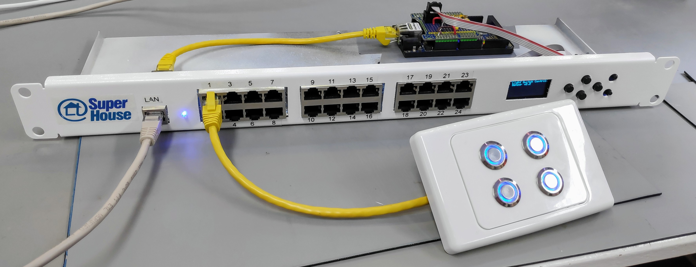

Home Automation Light Switch Controller
=======================================

Copyright 2019-2021 SuperHouse Automation Pty Ltd  www.superhouse.tv

A modular Light Switch Controller for DIY home automation projects.

This system uses UTP cable (typically Cat-5e because it's cheap) to
connect light switches to a central controller. The light switches
can be either very simple buttons or switches mounted in wall plates,
or smart switches with a microcontroller embedded.

The LSC provides 12V power down the line to each wall plate, which can
be used for LED illumination or to power more advanced light switches.

Light switches pull one of 4 signal wires in the cable to 0V to indicate
that they have been activated. The LSC pulls the signal wires high
internally and detects when they are pulled low.

RJ45 sockets on the LSC are connected to I/O channels via I2C
addressable I/O buffers. Each RJ45 socket provides connections for
GND, 12V, and 4 signal lines.

An LSC can be built with different numbers of ports and interface
options.

The design files for the I2C to RJ45 breakouts are now in a separate
repository:

  https://github.com/SuperHouse/I2CRJ45

Features:

 * RJ45 sockets for connection to light switches over Cat-5
 * I2C interface with interrupt output

More information:

  http://www.superhouse.tv/lsc

INSTALLATION
------------
The design is saved as an EAGLE project. EAGLE PCB design software is
available from www.cadsoftusa.com free for non-commercial use. To use
this project download it and place the directory containing these files
into the "eagle" directory on your computer. Then open EAGLE and
navigate to the project.

FIRMWARE
--------
See [Universal State Monitor](https://github.com/SuperHouse/USM) for 
firmware which is compatible with the LSC.

CREDITS
-------
 * Jonathan Oxer jon@oxer.com.au

DISTRIBUTION
------------
The specific terms of distribution of this project are governed by the
license referenced below.

LICENSE
-------
Licensed under the TAPR Open Hardware License (www.tapr.org/OHL).
The "license" folder within this repository also contains a copy of
this license in plain text format.
