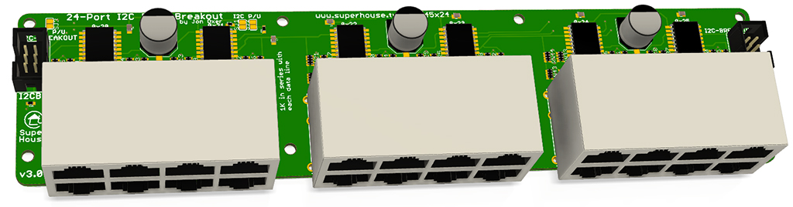

I2C to RJ45 Breakout (24 Port)
==============================
Copyright 2019-2021 SuperHouse Automation Pty Ltd  www.superhouse.tv  

24 RJ45 sockets connected to 96 I/O channels via I2C addressable
I/O controllers. Intended for use in building a home automation light
switch controller for connection to SuperHouse light switches.

Features:

 * 24 x RJ45 sockets for connection to light switches over Cat-5
 * I2C interface with interrupt output

This project has different versions:

 * 8-port version: https://github.com/superhouse/i2crj45x8
 * 16-port version: https://github.com/superhouse/i2crj45x16
 * 24-port version: https://github.com/superhouse/i2crj45x24
More information:

  http://www.superhouse.tv/i2crj45x24

INSTALLATION
------------
The design is saved as an EAGLE project. EAGLE PCB design software is
available from www.cadsoftusa.com free for non-commercial use. To use
this project download it and place the directory containing these files
into the "eagle" directory on your computer. Then open EAGLE and
navigate to the project.

CREDITS
-------
Designed by Jonathan Oxer jon@oxer.com.au

DISTRIBUTION
------------
The specific terms of distribution of this project are governed by the
license referenced below.

LICENSE
-------
Licensed under the TAPR Open Hardware License (www.tapr.org/OHL).
The "license" folder within this repository also contains a copy of
this license in plain text format.
